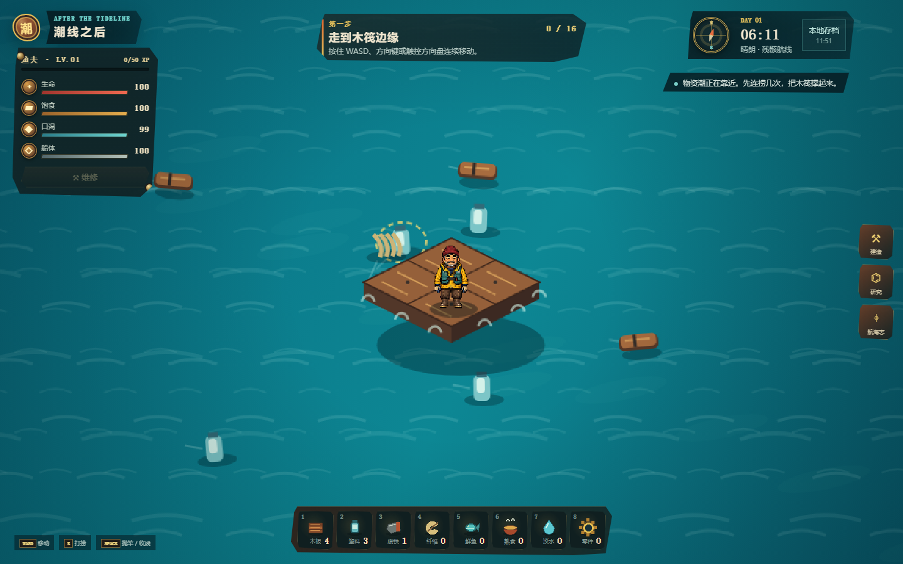
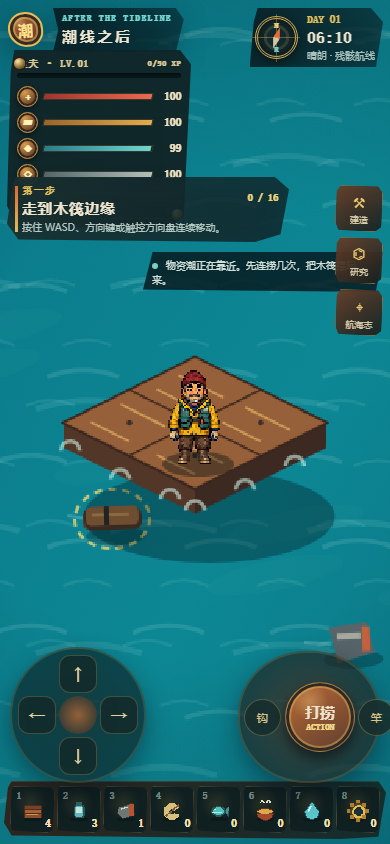

# 潮线之后 / Tide After

《潮线之后》是一个可直接游玩的单人海上木筏生存 Web 游戏垂直切片。画面采用标准 2:1 等距像素视角；玩家扮演一名落魄渔夫大叔，在被海洋淹没的世界里打捞漂浮物、钓鱼维生、建设设施、扩张木筏，并在昼夜与风暴之间决定何时冒险。

项目基于 MIT 许可的 [ThinkTidevibes/2D-Survival-Multiplayer-Game](https://github.com/thinktidevibes/2D-Survival-Multiplayer-Game) 改造，保留上游 Git 历史、React/Vite/TypeScript 工程和 SpacetimeDB 架构。当前玩法、世界观、界面和公开版本美术均为重新设计或原创内容。



## 核心循环

```text
八向移动 → 打捞漂浮物 → 钓鱼 → 维持生命/饱食/口渴
        → 建造设施 → 扩建木筏 → 夜间守筏 → 选择航线与风险 → 自动存档
```

- 从 2×2 木筏起步，通过一张“甲板扩建”成长卡整体升级到 3×3、4×4 并获得加固外环。
- 除甲板扩建外的设施都需要玩家选择具体甲板格或外缘槽位摆放，建造距离为人物两格内。
- 管理生命、饱食、口渴和船体耐久，收集 8 类资源。
- 利用收集网、过滤器、烤架和盐雾菜圃建立自动生产链；收集网只截获自身 150 像素范围内的漂浮物。
- 已建设施可消耗木板 1（高级设施废铁 1）搬动到新位置，也可一键定位。
- 在残骸带、渔场和避风航线之间选择不同的资源结构与风险回报。
- 经历昼夜、阴晴、风暴预警和船体损伤；随机海上事件弹窗暂时关闭。
- 第一天夜晚安全；从第二夜起迎战潮汐蟹和精英深渊灯兽，击退登筏怪物获得材料。
- 完成单一“当前目标”引导、每日合约、研究、章节、成就和信标目标。

难度、消耗、产出、生成频率、设施和研究定义集中在 `client/src/tide/config.ts`，调整平衡不需要改核心循环。

## 等距画面与角色动作

- 世界统一使用 2:1 投影：`screenX = centerX + (dx - dy) × 0.70`，`screenY = centerY + (dx + dy) × 0.35 - z`。
- 60×60 逻辑格绘制为约 84×42 的连续菱形甲板；接缝不超过 2 像素。
- 木筏具有 16 像素船体厚度、动态浸水线、木梁、绳结、迎流泡沫、紧贴船底的水下遮蔽和仅作用于渲染层的升沉/俯仰。
- 人物、帆、工作台、储物箱等对象按投影后的脚底或底边排序，角色可被高设施自然遮挡。
- 海面由低频涌浪、交叉浪与白色破浪组成；破浪经历浪尖形成、横向展开、破碎成数段白沫和逐渐消失四个阶段，晴天稀疏、阴天加密、风暴加宽加亮。
- 漂浮物真正按水面裁切：默认水下约 45% 被遮挡（木板 35%、废铁 55%），只保留非常淡的水下轮廓；水线经过处绘制白色短泡沫和少量气泡。
- 原创“落魄渔夫大叔”使用 512×512 透明图集：八行方向、每行 2 帧待机和 6 帧行走；行走约 12 FPS、待机约 4 FPS。
- 游戏规则仍以 100 ms 固定步长更新，Canvas 通过独立 `requestAnimationFrame` 和位置插值保持接近 60 FPS。
- 支持待机、行走、抛钩、回收、抛竿、等待、收线、建造、进食、饮水、维修、弯刀攻击和受伤反馈。

## 输入与交互

桌面端 WASD/方向键按屏幕方向移动，组合键提供八向控制。方向在输入时立即更新，动作结束后保留最后一次实际移动朝向。

场景左键由当前装备决定：

1. 破浪弯刀：攻击范围内的登筏怪物，空处点击播放挥砍但不结算伤害。
2. 打捞斧锤：点漂浮物打捞，点受损甲板维修。
3. 旧式鱼竿：点水面抛竿，等待时再次点击收线。
4. 钓鱼过程中再次点击始终优先收线。

钓鱼严格经过 `fishCast → fishWait → fishReel → idle`。同一指针从按下到释放只产生一个事务，快速双击、触控合成事件和键盘重复不会造成连续抛两次竿。当前装备始终绘制在人物手中并跟随八方向遮挡关系，切换装备会播放短促抬手动作。人物碰撞锚点固定在双脚中心，边缘采用预测移动加切线滑动，走到木筏边角不会卡死。

**建造摆放流程**：点击设施卡片进入摆放模式后，人物两格内的合法甲板格显示青绿、非法位置显示红色，收集网使用外围边缘槽并显示蓝色范围圈。点击合法格后播放三次敲击，第三次关键帧才扣除材料并创建设施；`Esc`、右键或手机“取消”按钮退出且不扣料。

| 操作 | 桌面端 | 手机端 |
| --- | --- | --- |
| 移动 | WASD / 方向键，可组合八向移动 | 按住左下方向盘连续移动 |
| 切换装备 | 数字键 1 / 2 / 3 或点击装备栏 | 点击三格装备栏 |
| 智能操作 | 场景左键 | 右下主操作按钮 |
| 打捞 | E / 点击漂浮物 | 主操作按钮 / “钩”按钮 |
| 钓鱼与收线 | 空格 / F / 点击空水面 | 主操作按钮 / “竿”按钮 |
| 食用与饮水 | 点击底部快捷栏 | 点击快捷栏 / 主操作按钮 |
| 维修 | 左上船体仪表 | 主操作按钮 |
| 建造、搬动、研究、航海志 | 右侧抽屉（约 420px 宽） | 底部全宽抽屉 |
| 建造选格 / 取消 | 点击青绿格 / Esc / 右键 | 点击青绿格 / 取消按钮 |

## 漂浮物与水流

- 新游戏生成 8 个漂浮物，其中前 4 个位于首轮可打捞范围。
- 活动物体硬上限为 18 个，基础生成间隔 4.2 秒，生命周期 55 秒。
- 漂浮物以 18–26 屏幕像素/秒从上游边界穿过画面，不再汇聚到木筏中心。
- 进入木筏外扩范围后按切线方向绕流，投影速度不会低于 16 像素/秒。
- 木板、塑料、废铁、纤维和货箱具有独立浸没深度、摇摆、尾流与气泡参数；前景浪峰会遮挡水线以下部分。
- 航线生成倍率：残骸 0.80、渔场 1.05、避风 1.25；风暴倍率 0.85。

## 快速开始

需要 [Node.js](https://nodejs.org/) 20 或更高版本。

使用代码 Agent 维护本项目时，请先阅读仓库级协作与运行指南 [AGENTS.md](./AGENTS.md)。

```bash
npm install
npm run dev
```

打开 Vite 输出的本地地址即可开始。默认无需登录或数据库，游戏使用浏览器 `localStorage` 自动保存游客身份和本局进度。

生产构建与预览：

```bash
npm run build
npm run verify:assets
npm run preview
```

## 存档与可选云快照

本地 `TideGameState` 是单人玩法的唯一运行时状态，存档保持 `schemaVersion: 2`。设施摆放位置保存在 `raft.placements` 中；旧存档缺少摆放数据时会按当前木筏尺寸生成确定性默认布局（优先保留生存设施），未处理的海上事件在加载时直接清除。游客身份和 `runId` 相互独立；重新开始会创建新 `runId`，但保留玩家身份和个人记录。

SpacetimeDB 只用于可选云快照，服务端不可用时游戏仍可离线运行：

```bash
spacetime start
spacetime publish -s local --module-path server tide-after
spacetime generate --lang typescript --out-dir client/src/tide/generated --module-path server
```

可在 `.env.local` 中配置：

```dotenv
VITE_SPACETIME_HOST=http://127.0.0.1:3000
VITE_SPACETIME_MODULE=tide-after
```

## 素材与本地参考模式

默认开发和生产构建只使用原创素材。新角色由图片生成工具制作概念与八方向初稿，再经过洋红背景透明化、裁切、锚点对齐和 512×512 图集整理。完整提示词、处理步骤和使用边界见 [ASSETS.md](./ASSETS.md)。

`C:/Users/hzy/Desktop/Content` 只允许作为本地只读参考目录，不复制进 Git 或生产包。Terraria 官方素材并非开源素材，版权仍属于 Re-Logic。参考模式需显式配置：

```dotenv
VITE_TIDE_ART_MODE=reference
TIDE_REFERENCE_ASSET_ROOT=C:/Users/your-name/Desktop/Content
```

开发服务器只允许读取 `Tiles_30.png`、`Tiles_19.png` 和 `UI/DisplaySlots_5.png`。目录缺失时自动回退原创素材；生产构建检测到参考模式会直接失败。

## 质量检查

```bash
npm test
npm run lint
npm run build
npm run verify:assets
```

当前验收基线：

| 检查项 | 结果 |
| --- | --- |
| 游戏规则、水面、夜战、投影、八向移动、摆放与动作测试 | 63/63 通过 |
| TypeScript / Vite 生产构建 | 通过 |
| ESLint | 通过，无警告 |
| 生产素材审计 | 通过，角色与 640×256 战斗图集均为 RGBA，未打包参考素材 |
| 桌面端 1440×900 | 装备切换、单次抛竿/收线、动态水线和新版漂浮物通过，无控制台异常 |
| 手机端 390×844 | 装备栏、长按移动、动作轮和全宽抽屉通过，无横向溢出或控制台异常 |
| 常规渲染性能 | 桌面与手机自动化验收均为 60 FPS，活动粒子上限 200 |



## 项目结构

```text
client/src/tide/                 状态、配置、规则、引导、存档与云桥
client/src/tide/visual/          投影、素材清单、动作、输入事务和场景渲染器
client/src/components/tide/      Canvas 场景、沉浸式 HUD 与抽屉
public/assets/tide-original/     公开版本原创运行时素材
art-source/tide-original/        原创美术源文件、透明化中间稿和旧角色归档
scripts/                         素材处理与生产构建审计脚本
server/src/tide_after.rs         SpacetimeDB 数据表与 Reducer
AGENTS.md                        Agent 运行、修改、验证与 GitHub 交付指南
ASSETS.md                        素材来源、生成过程与许可边界
UPSTREAM.md                      上游项目来源与改造边界
```

## 当前范围与许可

当前版本聚焦单人 Web 生存体验，已经包含轻量夜间守筏战斗；暂不包含多人联机、复杂武器养成、大型岛屿地图、完整账号系统和微信小程序打包。

项目继续保留上游 [MIT License](./LICENSE)。新增代码沿用仓库许可；第三方来源、参考边界和素材说明见 [UPSTREAM.md](./UPSTREAM.md) 与 [ASSETS.md](./ASSETS.md)。
