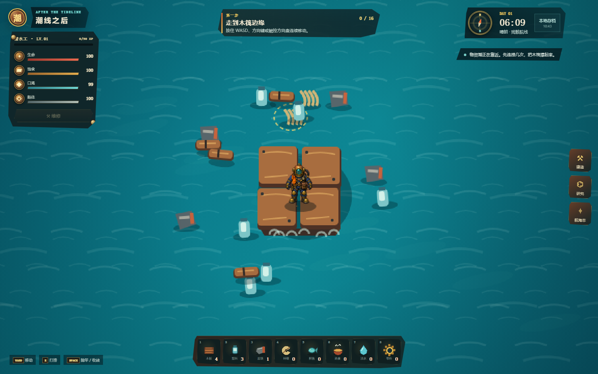
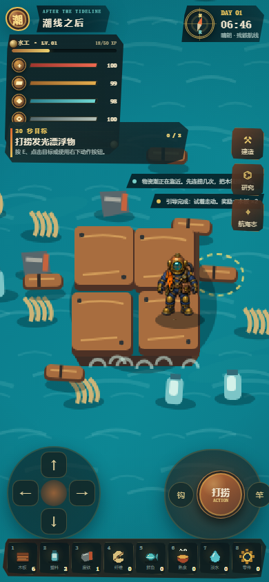

# 潮线之后 / Tide After

一款 2.5D 俯视角、像素风、单人海上木筏生存网页游戏。项目以 MIT 许可的 [ThinkTidevibes/2D-Survival-Multiplayer-Game](https://github.com/thinktidevibes/2D-Survival-Multiplayer-Game) 为技术底座，保留其 Git 历史、React/Vite/TypeScript 工程和 SpacetimeDB 架构，再将首屏与核心循环改造成原创木筏玩法。



## 游戏内容

- 2×2 初始木筏、生命/饱食/口渴/船体四项生存状态，以及失败重开机制。
- 漂浮物打捞、五连捞奖励、稀有补给箱和带时机判定的钓鱼小游戏。
- 木板、塑料、废铁、纤维、鲜鱼、熟食、淡水、零件 8 类资源。
- 从 2×2 到 3×3、4×4 的明显木筏扩建，以及 11 项可见设施。
- 收集网、过滤器、烤架和盐雾菜圃构成的自动化生产链。
- 6 步新手航程，每一步都有资源或经验奖励，前两天不受风暴船损。
- 漂流等级、经验、科技点和 6 条可升级研究路线。
- 每日合约、5 章长期航程、10 项成就、分数与完整本局统计。
- 三角帆解锁残骸、渔场、避风三条航线，分别改变资源与生存节奏。
- 补给箱、风墙、遇难者、旧世界无人机和鲸群等随机海上事件。
- 第 12 天建成信标后解锁无尽远航，继续刷新每日合约与最高分。
- 种子驱动的昼夜、晴浪/阴潮/风暴天气，以及第 3 天开始的船体损伤。
- 独立 60 FPS Canvas 渲染循环、底边深度排序、甲板侧厚、设施遮挡、三层海浪与最多 200 个粒子。
- 原创厚重潜水工四向精灵，以及打捞、收线、建造、进食、维修和受伤动作。
- 单一“当前目标”引导、风暴预警、普通/完美/脱钩三级钓鱼结果。
- 沉浸式铜制 HUD、8 格快捷栏、滑出式建造抽屉和手机端连续移动动作轮。
- 匿名游客身份、独立 `runId`、每 1.8 秒自动检查点、页面离开保存和 v1→v2 存档迁移。
- 可选 SpacetimeDB 云快照与服务端规范化表/Reducer；离线时完整玩法仍可运行。

所有难度、消耗、产出、设施和研究定义集中在 `client/src/tide/config.ts`，后续调节平衡不需要改核心循环。

## 直接运行

需要 Node.js 20 或更高版本。

```bash
npm install
npm run dev
```

浏览器打开 Vite 输出的本地地址。默认不需要登录或数据库，游戏会自动使用 `localStorage` 存档。

质量检查：

```bash
npm test
npm run lint
npm run build
npm run verify:assets
npm audit --omit=dev
```

当前测试包含 28 项验证：原 19 项规则测试全部保留，并新增动作优先级、关键帧单次提交、移动锁、素材回退、单一目标和完美收线测试。

## 控制

| 操作 | 桌面端 | 手机端 |
| --- | --- | --- |
| 移动 | WASD / 方向键 | 按住左下方向盘连续移动 |
| 打捞 | E / 点击漂浮物自动锁定 | 右下上下文按钮 / “钩”按钮 |
| 钓鱼与收线 | 空格 / F | 右下上下文按钮 / “竿”按钮 |
| 食用、饮水、维修 | 点击快捷栏 / 左上维修 | 点击快捷栏 / 上下文动作 |
| 建造、研究、航海志 | 右侧滑出抽屉 | 底部全宽滑出抽屉 |

## 本地参考素材模式

默认开发和生产构建都使用原创素材。若只在本机比较木材与 UI 纹理，可在 .env.local 显式配置：

    VITE_TIDE_ART_MODE=reference
    TIDE_REFERENCE_ASSET_ROOT=C:/Users/your-name/Desktop/Content

参考模式只读提供固定白名单；文件缺失会回退原创素材。参考模式禁止生产构建，详细边界见 [ASSETS.md](./ASSETS.md)。

## 可选 SpacetimeDB 模式

本地玩法不依赖服务端。要启用跨刷新/跨设备云快照，先安装 Rust 与 SpacetimeDB CLI，然后执行：

```bash
spacetime start
spacetime publish -s local --module-path server tide-after
spacetime generate --lang typescript --out-dir client/src/tide/generated --module-path server
```

也可以使用：

```bash
npm run spacetime:build
npm run spacetime:generate
```

复制 `.env.example` 为 `.env.local`：

```env
VITE_SPACETIME_HOST=http://127.0.0.1:3000
VITE_SPACETIME_MODULE=tide-after
```

前端会自动匿名连接；连接失败时保留本地存档并继续游戏。当前仓库已提交根据 v2 服务端模块生成的 TypeScript bindings。规范化 Reducer 校验身份、位置、资源、设施依赖、状态上限和重复领取；版本化快照负责快速恢复完整长局状态。

## 项目结构

```text
client/src/tide/                 状态类型、配置、规则、引导、测试、存档和云桥
client/src/tide/visual/          素材清单、动作控制器、rAF 2.5D 渲染器
client/src/tide/generated/       SpacetimeDB TypeScript bindings
client/src/components/tide/      Canvas 场景、HUD、建造/研究/航海界面
server/src/tide_after.rs         SpacetimeDB 表与服务端 Reducer
ASSETS.md                        视觉素材与许可证记录
UPSTREAM.md                      上游来源与改造边界
```

## 验收状态

- `npm run build`：通过。
- `npm run lint`：通过。
- `npm test`：28/28 通过。
- `npm audit --omit=dev`：0 个已知漏洞。
- SpacetimeDB WASM 模块：成功构建，bindings 已重新生成。
- 1440×900 桌面端：移动、抛钩、抛竿/收线、饮水、维修、三锤建造和抽屉均通过，无控制台异常和横向溢出。
- 390×844 手机端：长按连续移动、上下文动作轮和全宽抽屉通过，无控制台异常和横向溢出。
- 浏览器实测桌面与手机渲染均为 60 FPS，活动粒子不超过 200。
- 生产构建审计通过；参考模式生产构建会被主动拒绝。



## 当前边界

首版不包含多人联机、复杂战斗、敌人/NPC、岛屿地图、完整账号系统和微信小程序打包。上游旧模块仍保留在仓库和 Git 历史中，但不进入当前 `App` 入口。

## 许可与来源

本项目继续保留上游 [MIT License](./LICENSE)。原创新增代码按同一仓库许可证使用。第三方来源、参考边界与素材说明见 [UPSTREAM.md](./UPSTREAM.md) 和 [ASSETS.md](./ASSETS.md)。
